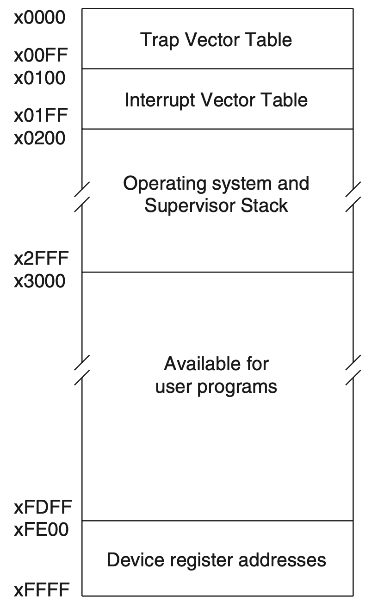
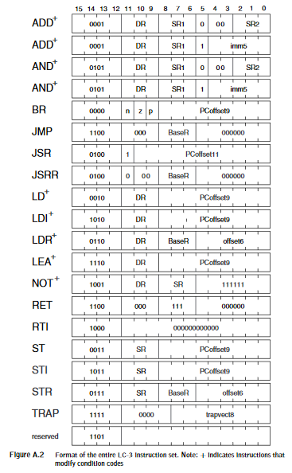

# Update: SoftSys GarbageEaters' LC-3 VM

> Gati Aher  
Caitlin Coffey  
Navi Boyalakuntla  
Zoe McGinnis  

---

## The Project

---

LC-3 is a reduced instruction set computer (RISC), meaning its architecture uses a small number of optimized instructions to complete tasks rather than a larger set of specialized instructions as is the standard for modern personal computers. The fastest computer in the world, Fugaku, uses the RISC model, as do most smartphones and microprocessors. LC-3 uses an instruction set that is simplified beyond practical use in order to introduce computer architecture concepts as they relate to virtual machines and emulators for educational purposes. For this reason, the LC-3 instruction set consists of only 15 instructions and uses a simplified memory system of 10 registers.

In this project, we aim to create a virtual machine in C that can run LC-3 assembly. Our *"definition of done"* is to have a virtual machine that can run LC-3 compiled from C. 

**Lower Bound:** Implement an MVP of a Virtual Machine that

- Simulate basic LC-3 computer with CPU, Memory, Registers, Instruction Set, Condition Flags, etc.
- Run processes and execute programs
- Perform binary arithmetic
- Read and write to memory
- Interact with I/O devices
- Build a calculator to prove above points work

**Upper Bound:** Implement most functions of a Virtual Machine

- Emulate a more advanced Operating System
    - Implement Tracing Garbage Collector (most common type)
- Write more complex C programs to run on LC-3, such as a program to display really grainy images and visuals (like a snake game)

## Learning Goals

---

We hope to learn more about how virtual machines work. We are also learning about how processes run in operating systems and how memory is broken down. Handling input-output system calls, and process interruptions is another portion of the project that we are diving deeper into.

## Our Implementation

---

**Register Specs:**

LC-3 is a register-based virtual machine (unlike Java VM which is stack-based). It uses both registers and disk space. Our implementation of virtual disk space follows the LC-3 specification described in Fig. 1. 

Registers are locations in memory that are easily accessible to the CPU. In the LC-3 specification, there are 8 general purpose registers, 1 condition register, and the program counter register. All registers hold 16 bits, except for the condition register which is a 3 bit register (it can store the modes of negative = 100, zero = 010, positive = 001). The program counter is a 16 bit unsigned integer that points to an address in our memory that contains the next program code instruction to execute. The program counter value is continually updated depending on the instruction being run.

Memory-mapped registers (reserved memory addresses xFE00 through xFFFF) is memory used for storing user input and displaying to the terminal. These are the following:

- Keyboard status register
- Keyboard data register
- Display status register
- Display data register

These registers help in handling input polling and interrupt processing as we do not want to overwrite data in our general registers when recording user input, and we need to pause any other processes occurring when user input needs to be taken in or information needs to be displayed.

At the beginning of the program loop, we load all of the machine instructions into a portion of memory for us to read through. We also store syscall processes in memory as well.

Fig 1: Memory map of LC-3 VM.

**Execution:**

Given a file of binary program code, our LC-3 virtual machine loads it into memory address x3000 to xFDFF, and converts it to the right format (LC-3 binary's are compiled to be in big endian format, but since we want our computers to read the binary correctly we have to convert to binary little endian format).

The binary file contains a list of 16-bit instructions. Fig 2. shows the how the 16-bit instructions are decoded. The first four bits (bits 15-12) designate an operation code, which tells the model which instruction to run. On an actual computer, opcodes are instructions that perform bit operations on hardware so that each one takes one atomic unit of a clock cycle and thus more complex operations can be composed of an efficient pipeline of opcodes. Our virtual LC-3 implementation substitutes C code for hardware, so we are not close enough to the hardware to actually make opcodes run in atomic unit time and make an efficient pipeline.

In our LC-3 VM's main function, we follow a classic RISC pipeline, detailed as follows:

A while loop runs until we get an ending signal in our instruction. On each loop, it carries out the following 5 steps:

1. (IF) Instruction Fetch: load one instruction from memory at the address stored in the program counter register
2. (ID) Instruction Decode: isolate the first four bits of the instruction, use a switch statement to determine which opcode it is
3. (EX) Execute: call code to perform the opcode
4. (MEM) Memory Access: access registers and memory to load and store values
5. (WB) Register Write Back: update general registers with output, update condition registers with 100, 010, or 001 value if the final output is negative, zero, or positive, respectively.

In our implementation, each of the possible instructions has a corresponding function which completes its functionality. Below are the instructions and their corresponding functions.

[Instructions](https://www.notion.so/13e95c7a601f42988fd14eda0e597c7e)

We have implemented the majority of the instructions. 

The binary program code is written in 16-bit chunks, where the first 4 bits of each sequence represent an opcode. Since 4 bits can represent 16 numbers (0-15) we use an enum structure to represent the 16 opcodes in a human readable way. We also write 15 opcode functions that take the 16 bit instruction as input, decode it 

Fig. 2: Instruction breakdown for instruction decoding.

TRAP codes link to a table of different system calls that are executed depending on the trap vector provided in the instruction. In memory, there is a location for the trap vector to be stored which will then link to functions that implement each of these different system calls.

[TRAP Vector Syscalls](https://www.notion.so/215f7dbd30e5448ba7ba0c945a13b5cf)

TRAP system calls act like an interrupt in that they save the current program position, execute the syscall, and return to the saved position once completed. We have yet to implement this functionality fully.

**Design Implementation Decisions:**

- We have implemented several helper functions:
    - Read program code into memory
    - Read to memory
    - Write to memory
    - Sign extension
- Instead of using hexadecimal values in our switch statement, we use enum to store all possible opcode values (numbers 0-15) in a human-readable way
- To read specific bits of the 16-bit instruction, we use a combination of bit-shifting and masking

## Current and Future Steps

---

We still have some work to do in order to have a fully functional virtual machine. Here are our remaining tasks:

- Implementing several instructions (everyone)
    - Definition of Done: Untested code that should run remaining instructions
- Finish TRAP code implementation (Gati and Navi)
    - Definition of Done: Finish implementation of syscalls according to the LC-3 specification. Place TRAP vector table at the appropriate location in memory. This does not need to be fully tested.
- Writing the program's main loop (Everyone)
    - Definition of Done: Write the main loop that execute instruction by instruction. This does not need to be fully tested.
- Testing (Everyone)
    - Definition of Done: Demonstrable tests for each opcode. Since the opcodes are built on every other function and structure in the program, functional opcodes indicate that all other structures function as intended.
- Write C programs that compile into LC-3 to run on our virtual machine (Everyone)
    - Definition of Done: Several fun programs in C that run without errors on our virtual machine.

## Resources

---

- LC-3 Specs Written By Its Developers: [https://highered.mheducation.com/sites/0072467509/student_view0/appendices_a__b__c__d____e.html](https://highered.mheducation.com/sites/0072467509/student_view0/appendices_a__b__c__d____e.html)
- Trap Opcode Further Reading: [http://pages.cs.wisc.edu/~sohi/cs252/Fall2012/lectures/lec08_input_output_traps.pdf](http://pages.cs.wisc.edu/~sohi/cs252/Fall2012/lectures/lec08_input_output_traps.pdf)
- Opcode Further Reading: [https://www.cs.utexas.edu/users/fussell/cs310h/lectures/Lecture_13-310h.pdf](https://www.cs.utexas.edu/users/fussell/cs310h/lectures/Lecture_13-310h.pdf)

## Useful Links

---

Trello: [https://trello.com/b/s83l2eWJ/softsys-garbagecollectors](https://trello.com/b/s83l2eWJ/softsys-garbagecollectors)

Github: [https://github.com/caitlincoffey/SoftSysGarbageEaters](https://github.com/caitlincoffey/SoftSysGarbageEaters)
